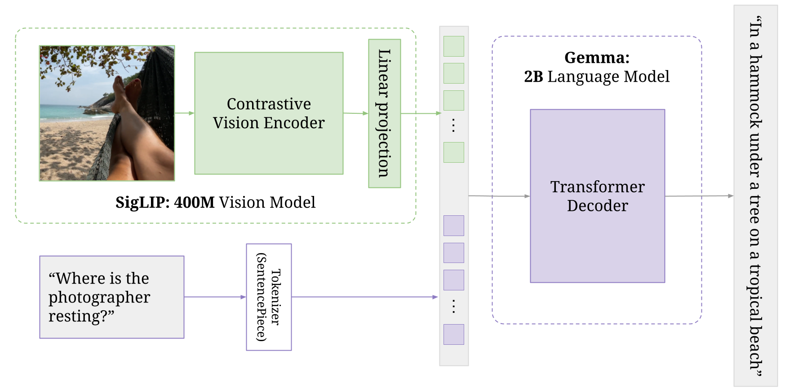

# About Paligemma and Its Capabilities

**Paligemma** is a state-of-the-art open Vision Language Model (VLM) from Google, combining a powerful vision encoder (ViT) with a Gemma language model. Its architecture allows it to connect visual information with human language, enabling a wide range of tasks.

### Key Capabilities

- **True Zero-Shot Versatility:**  
    Paligemma can perform tasks it was never explicitly trained to do. You can give it almost any free-form command (e.g., “read the text”, “what color is the car?”, “caption in Hindi”), and it will reason its way to the correct answer. This means you don’t need separate models for OCR, VQA, detection, or captioning.

- **Visual Grounding:**  
    The model not only recognizes objects but also provides the exact pixel coordinates for them. For example, when asked to “detect a cow,” it outputs special location tokens that allow drawing bounding boxes on the image.

- **Innate Multilingualism:**  
    Trained on a massive, multilingual dataset, Paligemma can understand and generate text in many languages. You can prompt it for captions or answers in languages like Hindi, Gujarati, or Spanish without needing a separate translation service.

- **Unified, Efficient Architecture:**  
    Paligemma replaces the need for multiple specialized models (OCR, object detection, VQA, etc.) with a single, elegant model. This simplifies code, reduces resource consumption, and provides a flexible tool for any visual-linguistic task.

### Example Use Cases

- Object detection and localization in images
- Visual question answering (VQA)
- Optical character recognition (OCR)
- Multilingual image captioning
- Following complex, natural language instructions about images

---
# Paligemma Zeroshot Implementation

This repository contains an implementation of the Paligemma Zeroshot model. The main code is provided in the Jupyter notebook `paligemma.ipynb`.

## Features
- **Zeroshot Inference:** Demonstrates zeroshot capabilities of the Paligemma model.
- **Sample Video:** A demonstration video of the model's working is included in the `samples` folder.

## File Structure
```
.
├── paligemma.ipynb         # Main Jupyter notebook with code and explanations
└── samples/
    └── VN20250614_103157.mp4  # Video demonstration of the model's working
```

## Getting Started
1. **Clone the repository**
2. **Open `paligemma.ipynb`** in Jupyter Notebook or VS Code.
3. **Run the notebook cells** to execute the code and see the results.

## Architecture
The architecture of the Paligemma Zeroshot model is illustrated below:



This architecture diagram (see `samples/image.png`) provides a visual overview of the model's components and data flow. The model leverages advanced neural network techniques to enable zeroshot inference, allowing it to generalize to new tasks without additional training.

## Video Demonstration
A video showing the working of the Paligemma Zeroshot implementation is available in the [`samples`](./samples) folder:

[](./samples/VN20250614_103157.mp4)

> If the video does not play in your markdown viewer, open it directly from the `samples` folder.

## Requirements
- Python 3.x
- Jupyter Notebook
- (Other dependencies as required by the notebook)

## Author
This code and implementation were created by **Hit Kalariya**.

- GitHub: [https://github.com/hitkalariya](https://github.com/hitkalariya)
- LinkedIn: [https://www.linkedin.com/in/hitkalariya/](https://www.linkedin.com/in/hitkalariya/)

## License
Specify your license here.

## Acknowledgements
- Paligemma model authors
- Any other contributors or sources
